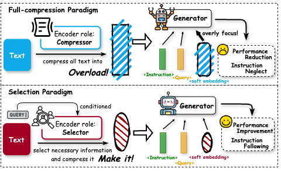
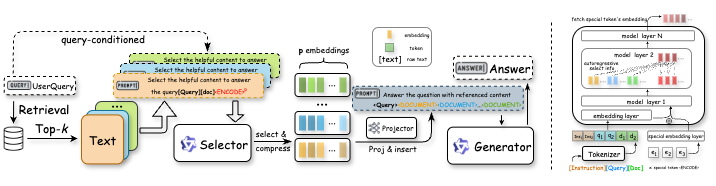
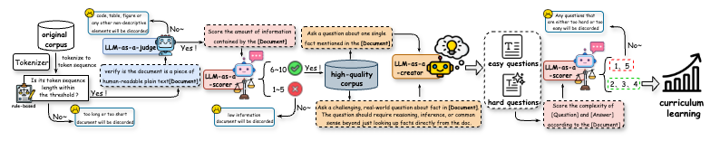

# SeleCom

This is the official implementation for the WWW2026 Paper: **Rethinking Soft Compression in Retrieval-Augmented Generation: A Query-Conditioned Selector Perspective**

</img>

## Paper Intro

**Main Pipeline** SeleCom replaces traditional full document compression with a query-conditioned selection mechanism. It includes a Selector that extracts query-relevant information from retrieved documents, a Projector that aligns compressed embeddings with the generator’s space, and a Generator that produces grounded answers using both the query and these embeddings. The framework is trained in two stages: Stage 1 trains the Selector and Projector for accurate information selection, and Stage 2 fine-tunes the Generator to utilize the compressed embeddings effectively.

</img>

**Data Construction** The training corpus is built through an LLM-assisted pipeline starting from the Wikipedia dump (~33M documents). Non-informative documents are filtered out, and LLMs are used to generate, verify, and grade QA pairs by difficulty. The resulting dataset, containing about 14 million (query, document, answer) triples, supports curriculum learning and enables robust training of the query-conditioned Selector.

</img>


## Introduction of this repository

This repository provides the implementation, data pipeline, and pretrained checkpoints of SeleCom. It contains the following contents:

```
.
├── checkpoint                # Folder for saving model checkpoints
├── data                      # Folder containing raw corpus and processed data
├── figures                   # Images used for README and paper visualization
├── log                       # Training and evaluation logs
├── main                      # Main entry point for training and evaluation
├── model                     # Core implementation (Selector, Projector, Generator)
├── results                   # Stores inference results from trained models
└── util                      # Utility functions (metrics, config, data loading)
```

## Run SeleCom

### Environmental Requirement

```
# 1. Clone the repository
git clone https://github.com/anonymous/SeleCom.git
cd SeleCom

# 2. Create a virtual environment
conda create -n selecom python==3.10 -y
conda activate selecom

# 3. Install PyTorch
pip install torch==2.6.0 --index-url https://download.pytorch.org/whl/cu124

# 4. Install Flash Attention
# Note: Ensure you download the wheel compatible with your specific CUDA/Torch version.
# The example below assumes the file is present locally.
pip install ./flash_attn-2.7.4.post1+cu12torch2.6cxx11abiFALSE-cp310-cp310-linux_x86_64.whl

# 5. Install remaining dependencies
pip install -e .
```

### For evaluation

**Step 1: Prepare Model**

To evaluate the model, ensure you have the pretrained checkpoints placed in the checkpoint/ directory. 

Huggingface link: [SeleCom_Trained_Model](https://huggingface.co/Ryan7458/Selecom/tree/main)

**Step 2: Prepare Data**

Download public datasets (e.g., NQ, TriviaQA) and process them into the (question, answer, documents) format. Save the processed file as a JSONL file (e.g., data/eval/nq_qa.jsonl).

**Step 3: Run Inference**

Configure and run the inference script.

```
cd main
bash run_eval_step1.sh
```

This will generate model outputs in the results/ directory

**Step 4: Calculate Metrics**

Compute metrics (EM, F1, LLM-as-a-judge) based on the results.

```
cd main
bash run_eval_step2.sh
```

### For training
SeleCom employs a two-stage training pipeline.

**Stage 1: Training the Selector & Projector** 

In this stage, the selector is trained on a massive synthetic QA dataset with curriculum learning.

We open-source the Stage 1 training dataset. Download the dataset from [SeleCom_Stage1_Training_Dataset](https://huggingface.co/datasets/Ryan7458/SeleCom_Training/tree/main) and run the training script.

```
cd main
bash train_stage1.sh
```

**Stage 2: Training the Generator**

In this stage, the generator is fine-tuned to utilize the compressed embeddings.

We open-source the Stage 2 training dataset. You can use your own training data or download the dataset from [SeleCom_Stage2_Training_Dataset](https://huggingface.co/datasets/Ryan7458/SeleCom_Training/tree/main) and run the training script.

```
cd main
bash train_stage2.sh
```

## License
This project is licensed under the MIT License.


  
